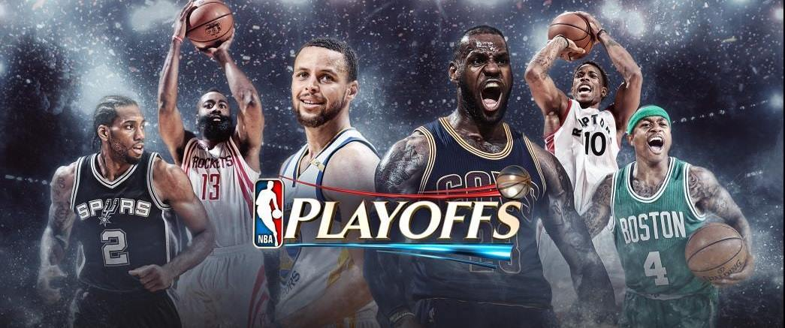

# ADS Project 5: :basketball: :basketball: :basketball: :basketball: :basketball: Who will win the 2017 Finals Champion :basketball: :basketball: :basketball: :basketball: :basketball:

Term: Spring 2017

+ Team 1 :bulb: The A Team
+ Projec title: :trophy: Who will win the 2017 Finals Championship :trophy:
+ Team members
	+ :octocat: Qingyuan Zhang
	+ :girl: Jihan Wei
	+ :cherry_blossom: Ruxue Peng
	+ :princess: Zixuan Guan
	+ :sunflower: Yue Jin
+ Project summary:

 NBA 2015-2016 season was unforgettable. The Golden State Warriors 73-9 made
 history. For the playoffs, OKC ended their journey even they got 3-0 over GSW
 at first. Then the same situation happened again to GSW, at the finals, GSW won
 over CLE by 3-0, but they dramatically lose the following 4 games. 

 This is why NBA is so enchanting. You can never predict what the game would be
 like till the last minutes.

 Then why this project? Because we want to train our machine on helping us
 make predictions without subjective opinions. 

+ ShinyApp:

URL: [Who wins the champion](https://amandazhang.shinyapps.io/testnba/)

:tada:Take a look at our prediction:

