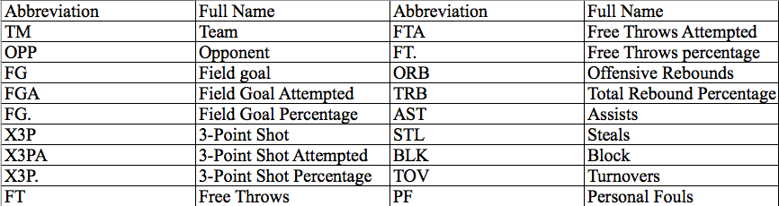

## The Paper

NBA 2015-2016 season was unforgettable. The Golden State Warriors 73-9 made history.
For the playoffs, OKC ended their journey even they got 3-0 over GSW at first.
Then the same situation happened again to GSW, at the finals, GSW won over CLE
by 3-0, but they dramatically lose the following 4 games.

This is why NBA is so enchanting. You can never predict what the game would be
like till the last minutes.

Then why this project? Because we want to train our machine on helping us make 
predictions without subjective opinions.

## The Data

The data used for this project is mainly scrapped from basketball-reference.com
and stats.nba.com. Among all kinds of measurement for a player, for a game, or
for a season, we chose to use these key features as measurement for the performance
of a team during one game played.

## The Data

Besides above features gained directly from game logs, we add two more features
into the model. One is called Efficiency, the other is ELO rating.

## The Data
- EFF Feature

- The NBA publishes online all the basic statistics recorded officially by the 
league. Individual player efficiency is expressed there by a stat referred to
as 'efficiency' and abbreviated EFF. It is derived by a simple formula below:
NBA Efficiency recap = ((Points + Rebounds + Assists + Steals + Blocks) - ((Field goals attempts - Field goals made) + (Free throws attempts - Free throws made) + Turnovers))
To construct the feature, we found out for each game, the player lineup of the
two teams and their minutes played in that game, then query their efficiency
score of the corresponding game season, at last we average over players’ EFF
score for the two team. 

- By incorporating the players’ efficiency score, we took into consideration the
influence of change of player at each game within our model. 

